# LABORATORIO DE SISTEMAS MOVILES Y UBICUOS 

#### *Fecha: 11/05/2023*
#### *Autores : Rubén Manzanas Rodríguez, Estela Cameo Pereira y Gonzalo García-Augustín García*

 

# Aplicación Tiendas Paco
 

>## Introducción
 

El objetivo principal de esta aplicación es crear una plataforma cuya funcionalidad sea que los usuarios realizar compras online en Tiendas Paco en las que podemos encontrar las diferentes secciones como frutería, carnicería, pescadería y tienda de deportes y, así, poder llegar al mayor número de clientes posible.
 
 

>## Creación de proyecto
 

Abrimos la aplicación Android Studio y creamos un nuevo proyecto. Para ello, en la barra de herramientas del margen superior izquierdo, hacemos clic en File, New, New Project. Se muestra una ventana para crear el nuevo proyecto, seleccionamos Empty Activity, asignamos el nombre "FruitShop" a nuestra aplicación, elegimos la ruta donde se va a guardar el proyecto, utilizamos lenguaje Kotlin, y hacemos clic en Finish. Ya hemos generado nuestro proyecto.
 
 

>## Directorios relevantes
 

Para el desarrollo de esta aplicación creamos un proyecto con el IDE Android Studio utilizando como lenguaje Kotlin.
Al crear un proyecto de Kotlin en Android Studio, se genera la carpeta "app" y la carpeta "gradle". Cuando creamos el proyecto, el sistema crea "app" y la aplicación lanza una "activity" (pantalla).

A. La carpeta "app" contiene el software relacionado con nuestra aplicación, donde incluiremos los archivos necesarios para que nuestra aplicación sea empaquetada. Dentro de esta carpeta, podemos acceder a otras. Por ejemplo en la carpeta manifests, podemos observar el archivo AndroidManifest.xml en que se declara todo aquello que realiza nuestra aplicación, así como si requiere unos permisos... En la carpeta res, podemos encontrar otras subcarpetas, como por ejemplo, layout que contiene el archivo activity_main.xml. Si accedemos a ese archivo y en la barra de herramientas del archivo en el margen superior derecho,hacemos clic en Split, aparece una representación de nuestra aplicación. Los layouts son unos contenedores y se utilizan para dar formato al diseño de nuestra aplicación introduciendo elementos como botones, spinner, seekbar textos...

1. Manifests:
    En este directorio se encuentra el archivo AndroidManifest.xml. Es un archivo de configuración que proporciona información esencial sobre la aplicación al sistema operativo Android. En este archivo hemos declarado el logo de nuestra aplicación para que cuando ejecutemos nuestra aplicación en un dispositivo, podamos ver en la miniatura de nuestra aplicación la imagen de dicho logo.

2. Java:
     

    2.1 ViewModel y LiveData:

    Hemos creado distintos directorios en función de las funcionalidades de nuestra aplicación: basket, butcher, fishMarket, fruitShop, sportShop y user. Estos directorios se encuentran dentro del directorio java. Además, el el directorio java, encontramos los archivos: ChatFragment, InboxFragment, MainActivity, MenuFragment y ShopViewModel. Estos archivos no los hemos organizado en directorios ya que comparten los mismos datos y, por tanto, utilizan el mismo ViewModel "ShopViewModel".

    Para implementar el ViewModel y el LiveData es necesario crear una nueva clase que permita separar la lógica de la interfaz de usuario de la actividad o el fragmento de la logica de negocio.
    
    En esta práctica, se ha implementado una clase ViewModel para cada fragmento, a excepción de aquellos fragmentos que compartían datos, los cuales han usado la misma clase ViewModel como hemos citado anteriormente.
    Estos fragmentos se encuentran en el directorio java.

    2.2  Room.

    Para implementar Room hemos creado los siguientes archivos:

    - RoomDao: es una interface en la cual están todas las querys necesarias para la consulta a la base de datos.

    - RoomDataBase: es una clase abstracta de Room que sirve para crear y acceder a la base de datos de una aplicación.

    - RoomEntity: clase de Kotlin encargada de definir una entidad en Room.

    - UserViewModelFactory: es una clase utilizada para crear instancias del ViewModel que necesita acceso a la base de datos Room.

    Estos archivos se encuentran en el directorio java y dentro de él, en el directorio user.

    2.3 RecyclerView: 

    Para implementar RecyclerView hemos creado los siguientes archivos:

    - DiffUtilsCallback: clase que se encarga de que cuando se refresquen los datos, solo se muestren los items que cambian.

    - ItemAdapter: clase en la que se realizan llamadas a los métodos para que cuando el RecyclerView solicite las vistas, vincule estas a sus datos.

    - ItemViewHolder: clase en la que cada elemento individual de la lista está definido por un objeto contenedor de vistas. Cuando lo crea, este contenedor no tiene datos asociados. Después RecyclerView lo vincula a sus datos. 

    Estos archivos se encuentran en el directorio java, dentro de él, en el directorio basket y en este directorio hemos creado otro directorio llamado recyclerView.

3. Res:
     

    3.1 Layouts:

    El directorio layouts contiene los archivos en los que se han definido los distintos elementos para perfeccionar la vista de nuestra aplicacion teniendo en cuenta las distintas secciones cuando presenta orientación vertical y, los layouts (land) en los que se han definido los distintos elementos para perfeccionar la vista de nuestra aplicacion cuando presenta orientación horizontal. Contiene el archivo activity_main.xml. Si accedemos a ese archivo y en la barra de herramientas del archivo en el margen superior derecho, hacemos clic en Split, aparece una representación de nuestra aplicación. Los layouts son unos contenedores y se utilizan para dar formato al diseño de nuestra aplicación introduciendo elementos como botones, spinner, seekbar textos... Además, se ha creado el fichero itemspinner.xml que contiene las vistas del texto e imagen del producto seleccionado en el spinner de cada sección de la tienda y el fichero nav_header.xml que contiene los elementos para dar vista a la pestaña de menú de nuestra aplicación. Estos ficheros se encuentran en el directorio layout que se encuentra dentro del directorio res.

    3.2 Drawable:

    Todas las imagenes de los distintos tipos de productos disponibles en la tienda que se usan en la aplicación están en el directorio drawable, que se encuentra dentro del directorio res.

    3.3 Menu:

    En el directorio res, hemos creado otro directorio "menu" que contiene un archivo para el menú de nuestra aplicación.

    3.4 Navegacion:

    Para la realización de la navegacion, es necesario crearnos una nueva carpeta que sea de tipo "Navigation", definir un grafo de navegación xml (en nuestro caso se llama "navigation.xml") que será el encargado de realizar la navegación.

    3.5 Values:

    El fichero strings.xml contiene los textos con nombre único que se utilizan para acceder a ellos desde el código de la aplicación. También encontramos el fichero strings.xml (con miniatura bandera de España) que contiene los textos definidos en strings.xml pero traducidos al español y el fichero strings.xml (con miniatura bandera de Francia) que contiene los textos definidos en strings.xml pero traducidos al francés. Esto es útil si un usuario desea cambiar el idioma del inglés al español o al francés. Estos ficheros se encuentran en el directorio strings que se encuentra dentro del directorio values, y a su vez, se encuentra dentro del directorio res.

B. La carpeta "gradle" contiene un paquete de herramientas de compilación avanzadas, para automatizar y administrar el proceso de compilación y, al mismo tiempo, definir configuraciones de compilación personalizadas y flexibles. En el archivo build.gradle del directorio Gradle Scripts, hemos añadido las dependencias necesarias para las distintas funcionalidades de nuestra aplicación: ViewModel, LiveData, Navigation, Material Design, RecyclerView y Room.
 

 

>## Desarrollo
 

>### Requisitos del prototipo básico
 

Al ejecutar la aplicación, lo primero que veremos será la pantalla principal, que nos brindará acceso a diferentes secciones de la tienda, como la frutería, carnicería, pescadería y la tienda de deportes. Al seleccionar la imagen de alguna de estas secciones, la aplicación nos llevará directamente a la pantalla correspondiente.

En la parte de navegación se ha implementado un práctico "Drawer Menu", lo que facilita la navegación en la aplicación y permite al usuario acceder rápidamente a cualquier sección disponible en el "Drawer Menu".

 

Al desplegar el "Drawer Menu", en primer lugar aparecerá en la parte superior el logo de la empresa. Debajo de este, se encuentran cuatro opciones de navegación que nos permiten acceder a las diferentes secciones de la aplicación. Cada opción se representa con un icono específico y su respectivo nombre:

1. El primer icono que aparece en el "Drawer Menu" es el "User". Al seleccionar esta opción, la aplicación nos llevará a un formulario en el que el usuario puede iniciar sesión en la cuenta de usuario o bien, crear una nueva cuenta y registrarse. Este formulario consta de dos campos: "User" y "Password". Si el usuario ya tiene una cuenta, puede ingresar su información en los campos de usuario y contraseña y luego hacer clic en el botón "Sign In" para acceder a la cuenta. Si el usuario no tiene una cuenta, se puede registrar rellenando los campos de usuario y contraseña y hacer clic en el botón "Sign Up". En ambos casos, si los campos de usuario y contraseña no contienen texto o se dejan sin rellenar, no se podrá iniciar sesión ni registrarse, es decir, los botones de "Sign In" y "Sign Up" no funcionan. Una vez que el usuario ha iniciado sesión en su cuenta o se ha registrado, la aplicación nos llevará a la misma pantalla del "User" donde se le dará la bienvenida junto con su nombre de usuario y se le brindará la opción de cerrar sesión gracias a un botón. Si el usuario decide cerrar sesión, volverá a la pantalla de inicio de sesión y registro con los formularios disponibles. Si el usuario intenta registrarse con una cuenta de usuario ya existente, al hacer clic en el boton de registrarse, aparecerá un mensaje para avisar al usuario de que la cuenta de ese usuario ya existe. Si el usuario intenta iniciar sesión con una cuenta de usuario que no existe, aparecerá un mensaje para avisar al usuario de que el usuario no existe,regístrese.Por último, si el usuario intenta iniciar sesión con una cuenta de usuario que existe, pero introduce una contraseña incorrecta, aparecerá un mensaje para avisar al usuario de que la contraseña es incorrecta.
Además, si el usuario no ha iniciado sesión con su cuenta o no está registrado, cuando desee finalizar su compra y haga clic en el botón de comprar, este botón estará desactivado y no podrar finalizar la misma.

2. El segundo icono que aparece en el "Drawer Menu" es el "Chat". Al seleccionar esta opción, la aplicación nos llevará a una pantalla de chat simulado donde el usuario puede interactuar con la tienda. El usuario puede escribir mensajes en el campo de entrada y enviarlos presionando el botón "Enviar". Los mensajes aparecerán en la ventana de chat, debajo del último mensaje enviado.
Si el usuario sale de la pantalla del "Chat" y vuelve a ingresar, los mensajes que haya escrito anteriormente se habrán guardado y aparecerán en el chat. Esta función permite al usuario continuar con la conversación desde donde la dejó anteriormente. Si un usuario no registrado desea acceder al Chat, en la pantalla del Chat aparece un mensaje para avisar al usuario de que no está registrado para que inicie sesión y pueda escribir un mensaje en el chat. Solo pueden escribir un mensaje en el chat los usuarios que hayan iniciado sesión o que estén registrados.

3. El tercer icono que aparece en el "Drawer Menu" es el "Inbox". Al seleccionar esta opción, la aplicación nos llevará al inbox de la tienda, donde el usuario puede ver todos los mensajes enviados.
Si el usuario ha enviado algún mensaje, se proporcionará un botón que permite al usuario borrar todos los mensajes enviados. Si un usuario no registrado desea acceder al Inbox, en la pantalla del Inbox aparece un mensaje para avisar al usuario de que no está registrado para que inicie sesión. Solo pueden consultar el inbox los usuarios que hayan iniciado sesión o que estén registrados.

4. El cuarto icono que aparece en el "Drawer Menu" es el "Total Basket". Al seleccionar esta opción, la aplicación llevará al usuario a la pantalla que muestra la lista de todos los productos que han sido seleccionados en la frutería, carnicería, pescadería y tienda de deportes, junto con la cantidad de cada item que se ha seleccionado. Se puede eliminar cada producto añadido a la cesta si lo desea haciendo clic en el icono de eliminar.
En la parte inferior de la cesta, aparecerá el precio total de la compra. Esta función permite al usuario tener una vista general de todo lo que ha seleccionado y asegurarse de que no haya errores.
Se proporcionarán dos botones, uno para vaciar la cesta y otro para finalizar la compra. El botón "Vaciar cesta" permite al usuario eliminar todos los productos que ha seleccionado. El botón "Comprar" permite al usuario "finalizar la compra". Este botón se deshabilita si el usuario no ha iniciado sesión o no está registrado y, por tanto, no puede realizar la compra. Si el usuario ha iniciado sesión o está registrado, y selecciona el botón "Comprar", es dirigido a otra pantalla para tramitar la compra en la que se le pide al usuario que introduzca sus datos de método de pago y su dirección. En el apartado de Método de Pago, el campo de número de tarjeta tiene que ser de 16 dígitos numéricos, el campo de fecha tiene que tener el formato MM/AA, siendo MM el mes y AA las dos últimas cifras del año, el campo de CVC tiene que ser de 3 dígitos numéricos; en el apartado Dirección, todos los campos tienen que ser strings, excepto el campo número que tiene que ser un número. Si en alguno de los campos de esta pantalla, el usuario introduce datos que no cumplen las características anteriormente citadas, dicho usuario no puede finalizar la compra.

En esta pantalla, aparecen dos botones, el botón de "Comprar" para realizar la compra ya una vez introducidos los datos requeridos y el botón "Cesta" por si el usuario quiere consultar los productos que tiene en la cesta antes de finalizar la compra. Si el usuario pulsa el botón "Comprar", se le redirige a otra pantalla en la que se confirma la compra realizada y puede volver a la página principal de nuestra tienda si lo desea clicando en el botón de "Página principal".

 

Si accedemos a la sección de frutería desde la pantalla principal, seremos llevados a una nueva pantalla que muestra, un spinner con el que podemos seleccionar la fruta deseada, una cesta vacía y un icono que nos llevará a la pantalla de "Total Basket".
Al desplegar el spinner, se mostrarán las frutas disponibles con sus respectivas imágenes. Al seleccionar una fruta, aparecerá un "SeekBar" que nos permitirá seleccionar la cantidad que deseamos de la fruta elegida. Una vez seleccionada la cantidad, se mostrará el precio por unidad y el precio de la fruta asociado a la cantidad elegida. Si pulsamos el botón "Add", la fruta será añadida a la cesta. La cesta se actualizará y mostrará la foto del producto y la cantidad seleccionada. Se puede eliminar cada producto añadido a la cesta si lo desea haciendo clic en el icono de eliminar. Además, se actualizará el precio de la cesta de frutas y el precio total de la compra.
La aplicación proporcionará la opción de vaciar la cesta de frutas solo si hay elementos en ella.
Si seleccionamos "Select the fruit" en el spinner (el elemento neutro), los elementos para añadir una fruta como el SeekBar, botón "Add"... desaparecerán de la vista del usuario.
Si seleccionamos el icono "Total Basket", seremos llevados a la cesta total donde aparecerán todos los elementos de cualquier sección que hayamos seleccionado para comprar, junto con el precio total de toda la compra.

 

La pescadería, la carnicería y la tienda de deportes, tienen la misma funcionalidad que la frutería pero personalizada para cada sección, ofreciendo los productos correspondientes a cada una de ellas y respetando los precios de la cesta de cada sección.

 

La aplicación garantiza la persistencia de la información en todo momento. Lo que significa que los productos seleccionados, las cantidades elegidas, los precios y otros datos relevantes se mantienen guardados incluso en caso de que se produzcan cambios de configuración en el dispositivo móvil. De esta manera, el usuario puede continuar desde donde dejó su actividad en la aplicación sin perder información importante.

 

Cuando accedamos a cualquiera de las secciones de la aplicación, se mostrará automáticamente un botón de "Atrás" en lugar del "Drawer Menu". Esto nos permitirá regresar fácilmente a la pantalla anterior.
 

 

>### Requisitos extras
 

Los extras que se han incluido en la aplicación son:

* Definición de un nombre para la aplicación "Tiendas Paco".
* Se ha limitado la prueba de concepto a cuatro productos de cada tipo.
* Soporte multilenguaje Inglés/Español según la configuración del teléfono.
* Persistencia de la información entre cambios de orientación.
* Las pantallas horizontal y vertical tendrán un layout diferente acorde con el espacio proporcionado. En algunos casos hemos utilizado un ScrollView.
* Fotografía del producto en las opciones del Spinner.
* Fotografía del producto en los productos añadidos a la cesta.
* Evitar tener que pulsar el botón para seleccionar una producto en el Spinner
* Se muestra el precio/pieza del producto seleccionado.
* Dos opciones de acceso para el usuario: iniciar sesión o registrarse.
* Guardar el nombre del usuario que inició la sesión.
* Posibilidad de cerrar la sesion si el usuario inició la sesión anteriormente.
* "Flecha Hacia Atrás" que permite volver a la pantalla anterior.
* En el drawer menu se encuentra un botón para acceder a User, Chat, Inbox y Total Basket.
* Cambio automatico del "Drawer Menu" por una "Flecha Hacia Atrás" para poder acceder a la anterior pantalla.
* En la barra de título superior de la aplicación aparece el nombre de la pantalla en la que nos situamos.
* Posibilidad de vaciar la cesta de una sección.
* Posibilidad de vaciar la cesta total.
* Posibilidad de vaciar cada tipo de producto en la cesta total.
* Posibilidad de comprar los productos que hay en la cesta total.
* No permitir que el usuario inicie sesion o cree una cuenta si todos los campos no estan rellenos.
* Boton dentro del Inbox que permite borrar los mensajes escritos por el usuario.
* Logica de negicio del User.
* Logica de negocio del Chat.
* Logica de negocio del Inbox.
* Todos los recursos se han definido en el directorio res siguiendo un modelo de buenas prácticas.
* Inicio o registro de un usuario:
    * Control inicio de sesion de usuario incorrecto.
    * Control inicio de sesión de contraseña incorrecta.
    * Control de registro usuario repetido.
    * Control inicio de sesión/registro de campos usuario y contraseña completos.
* Mejora que haga la pantalla más atractiva desde el punto de vista funcional como:
    * Logo de la empresa
    * Cambio de color de los elementos en función del fragment.
    * Delimitación de la cesta entre barras.
    * Integracion de iconos en las respectivas secciones.
    * Letras de distinto tamaño y colores.
    * Botones de diferentes colores en función de su utilidad. 
    * Cambio de color del SeekBar. 
    * Cambio de nombre del Navigation en función del fragment. 
    Para ello, se han utilizado: padding, gravity, layout_gravity, layout_height, layout_weight, layout_margin (Top, Bottom, Start, End), textColor, progressTint, textSize, backgroundTint, textStyle...
* Almacenar los datos (usuario y contraseña) de los usuarios en la base de datos SQLite utilizando Room.
* Añadir elementos de forma dinámica utilizando RecyclerView.

 

>## Explicación de conceptos
 

Para la realizacion de la practica ha sido necesario introducir nuevas librerias y nuevos conceptos.

- ViewModel: El ViewModel es responsable de mantener y administrar los datos relacionados con la interfaz de usuario, se ocupa de la supervivencia a los cambios de configuración

- LiveData: es una clase que se utiliza para almacenar y observar datos. Los objetos LiveData son observados desde el ViewModel y actualizados automáticamente cuando cambian los datos.

- Romm: es una biblioteca de persistencias de datos que forma parte de Android Jetpack. Es una capa de abstracción que se ubica sobre una base de datos SQLite. SQLite usa un lenguaje especializado (SQL) para realizar operaciones de bases de datos. En lugar de usar SQLite directamente, Room simplifica las tareas de implementar, configurar y usar la base de datos. Room también proporciona comprobaciones de tiempo de compilación de las sentencias de SQLite. Hemos utilizado Room para almacenar los datos (usuario y contraseña) de los usuarios en la base de datos SQLite.

- RecyclerView: RecyclerView facilita la visualización eficiente de grandes conjuntos de datos. El programador suministra los datos y define cómo se ve cada elemento, y la biblioteca RecyclerView crea dinámicamente los elementos cuando son necesarios. Como su nombre lo indica, RecyclerView recicla las vistas de elementos para que el desplazamiento sea más eficaz. Cuando un el elemento se desplaza fuera de la pantalla, RecyclerView no destruye su vista. En cambio, RecyclerView reutiliza la vista para nuevos elementos que se han desplazado en pantalla. RecyclerView mejora el rendimiento y la capacidad de respuesta de su aplicación, y reduce el consumo de energía. Hemos utilizado RecyclerView para añadir elementos de forma dinámica. Con esto conseguimos menor número de items en los layouts.
 
 

>## Pre-requisitos
 

- Android Studio.

- JDK (Java Development Kit).

- Un dispositivo Android.
 
 

>## Creación de dispositivos
 

Después, creamos el dispositivo. Si nuestro dispositivo es un Smarthphone, en la barra de herramientas del margen superior derecho, hacemos clic en Device Manager, en la pestaña de Virtual, clicamos en Create device. Se muestra una ventana para seleccionar el hardware, seleccionamos: Pixel 6 como definición del dispositivo, Oreo (API Level 27) como imagen del sistema (tiene que ser descargada), Portrait como orientación de inicio y clicamos en Finish. Ya tenemos nuestro dispositivo creado. Si nuestro dispositivo es una tablet, configuramos dicha tablet en modo desarrollador, en las opciones de este modo, seleccionamos las opciones: Depuración de USB y verificar aplicaciones por USB.
 
 

>## Ejecución del proyecto
 

Si nuestro dispositivo es un Smarthphone, en la herramienta de Device Manager, en la pestaña de Virtual clicamos el botón de play del dispositivo creado. Podemos observar que en la heramienta Emulator, aparece el dispositivo creado para poder probar sus funcionalidades. Después, ejecutamos la aplicación, clicando el botón de Run 'app'. Si nuestro dispositivo es una tablet, conectamos la tablet al ordenador en el que hemos desarrollado nuestra aplicación y en el IDE Android Studio, en la barra de herramientas del margen superior derecho, hacemos clic en Device Manager, en la pestaña de Physical, podemos observar nuestro dispositivo conectado, lo seleccionamos y ejecutamos la aplicación, clicando el botón de Run 'app'.
 
 

>## Imágenes
 

Fotos de la aplicación tras ejecutarse:
 

* ## Aplicación en español: 
 
A continuación se muestran las imágenes de nuestra aplicación en español.
 
 

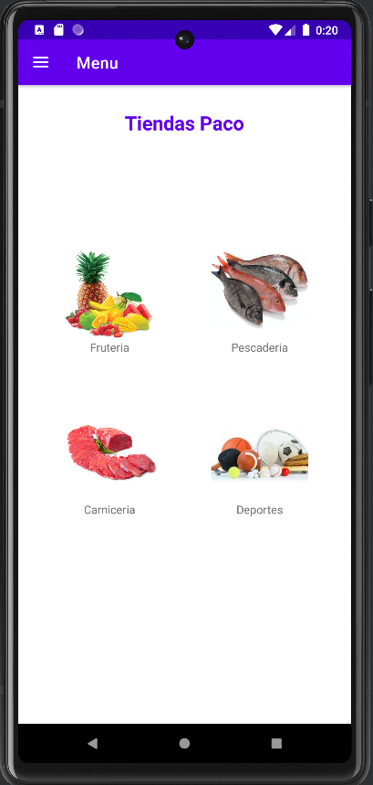
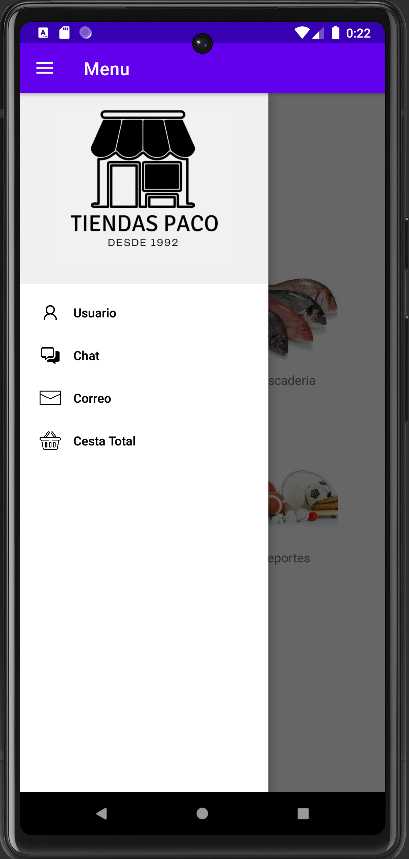
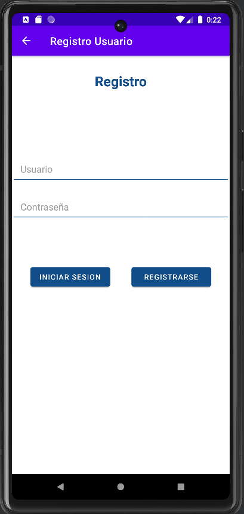
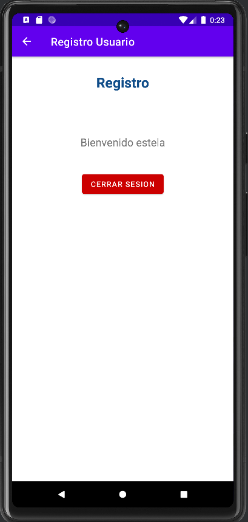
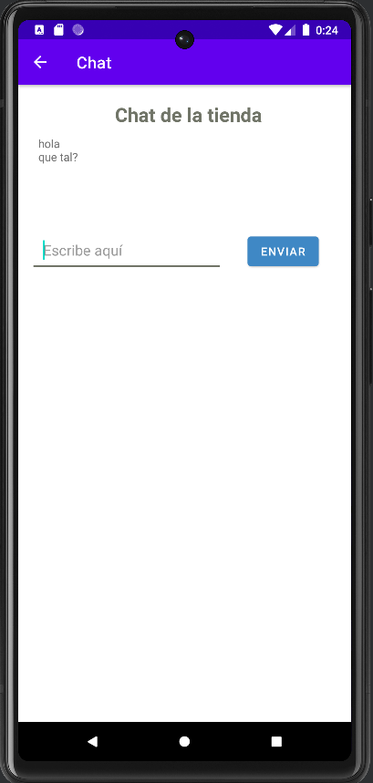
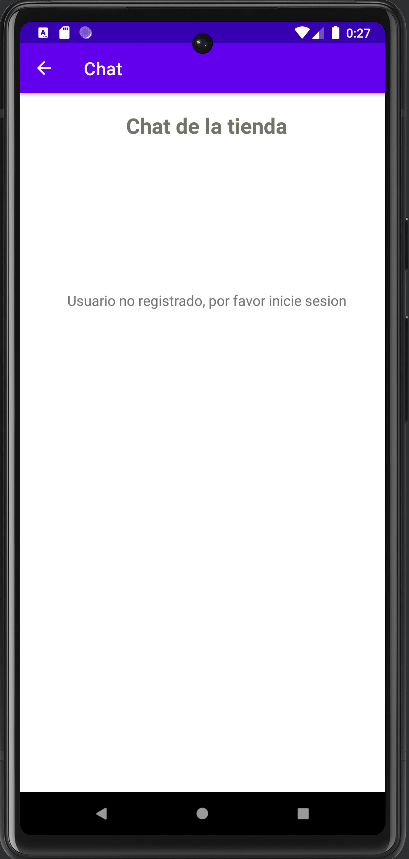
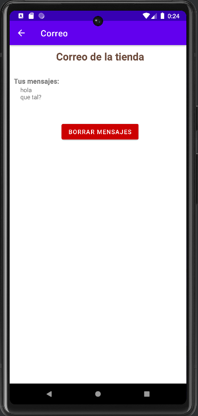
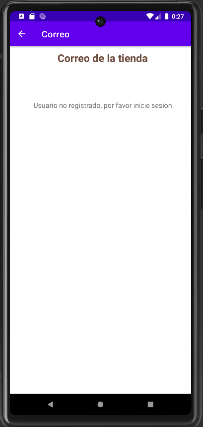
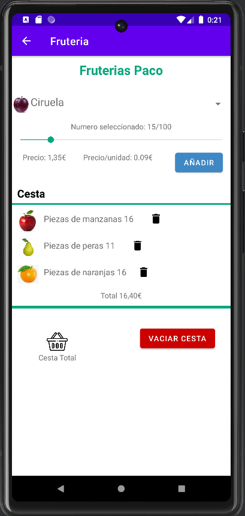
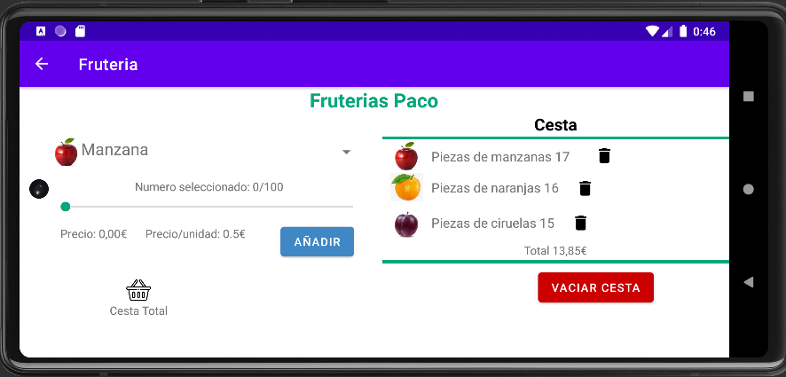
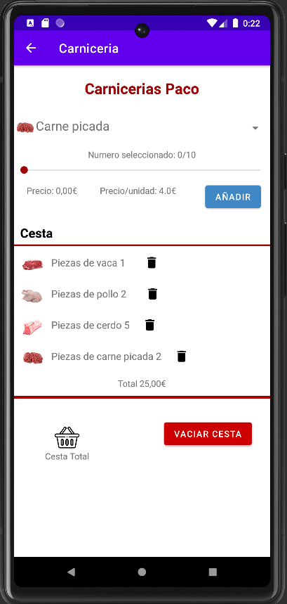
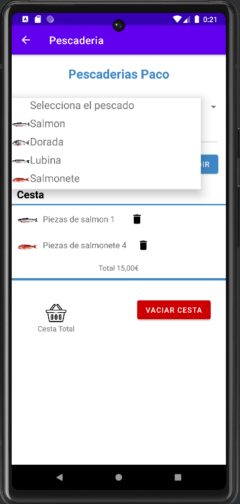
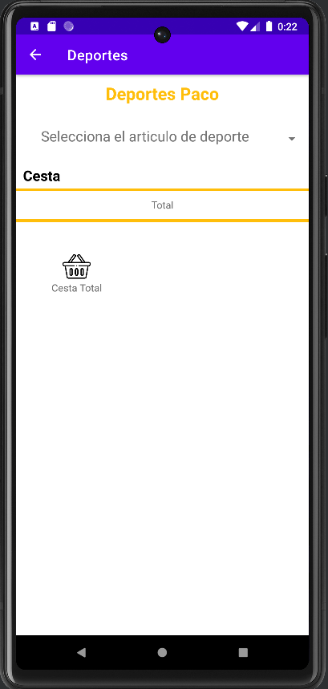
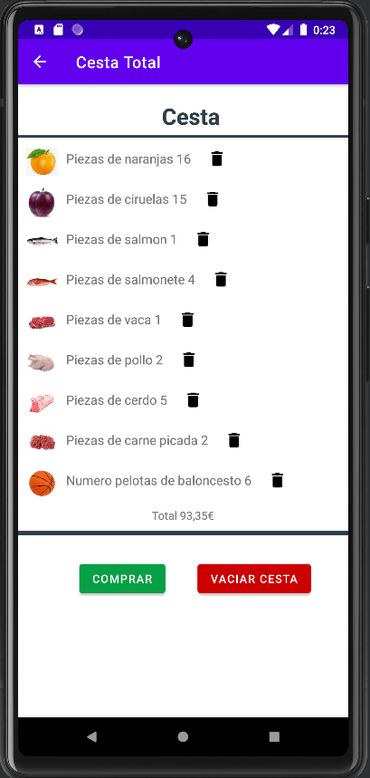

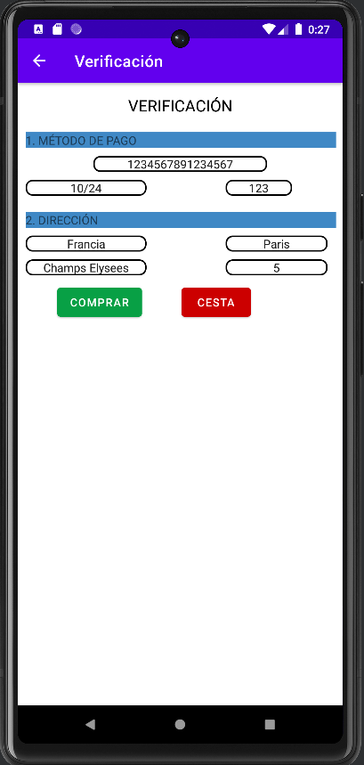
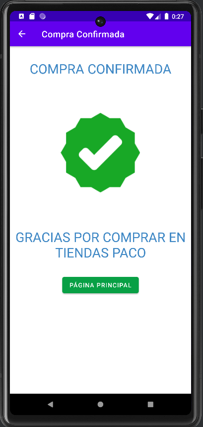

 
 

* ## Aplicación en inglés: 
 
A continuación se muestran dos imágenes en las que se ha cambiado el idioma del dispositivo al inglés.
 
 

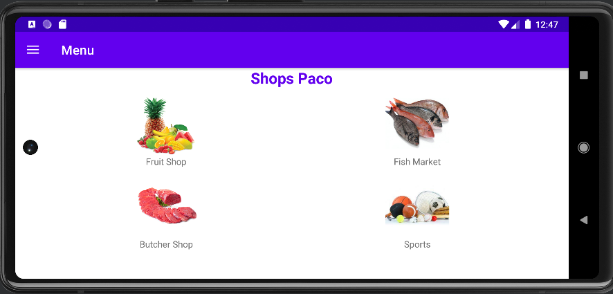

 

* ## Aplicación en francés: 
 
A continuación se muestran dos imágenes en las que se ha cambiado el idioma del dispositivo al francés.
 
 

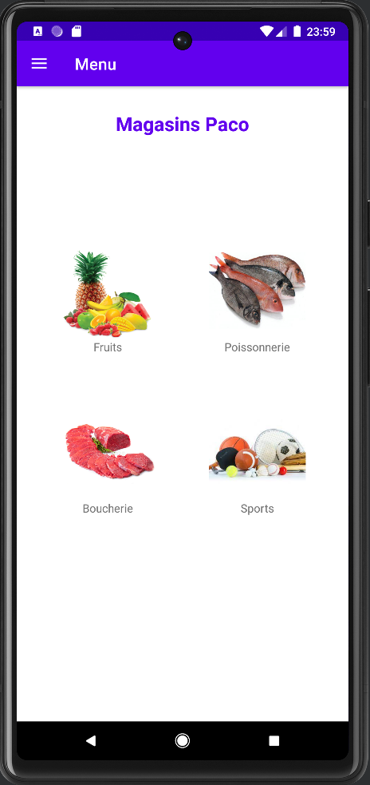
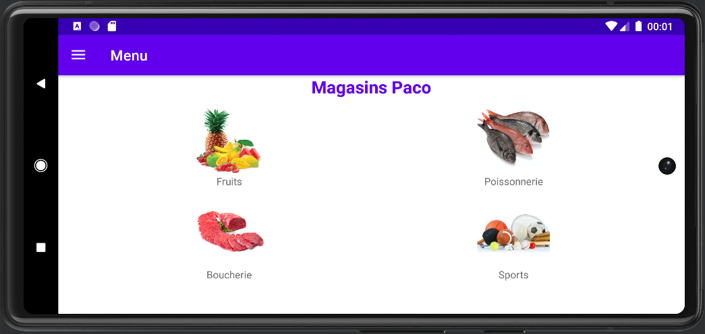

 

>## Conclusión
 

El proyecto en el que hemos trabajado utilizando Kotlin y Android Studio ha sido una experiencia enriquecedora y gratificante. Trabajar en equipo nos ha permitido compartir conocimientos, habilidades y experiencias, lo que ha contribuido a crear un ambiente de colaboración y apoyo mutuo.

Hemos enfrentado desafíos y obstáculos durante el desarrollo del proyecto, pero gracias a nuestra dedicación, compromiso y trabajo en equipo, hemos logrado superarlos y alcanzar nuestros objetivos. La utilización de Kotlin y Android Studio nos ha permitido desarrollar una aplicación con un alto nivel de calidad y funcionalidad.

Agradecemos a nuestros profesores por su apoyo, orientación y enseñanza a lo largo del curso. Su experiencia y conocimientos han sido fundamentales para el éxito de nuestro proyecto. Estamos orgullosos del trabajo que hemos realizado y estamos seguros de que esta experiencia nos servirá en el futuro para seguir creciendo y desarrollándonos como profesionales.

En resumen, este proyecto ha sido una oportunidad para aprender y crecer, tanto en lo personal como en lo profesional. Esperamos que nuestra aplicación sea de utilidad para los usuarios.

   
